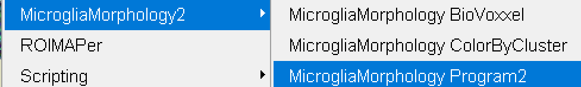
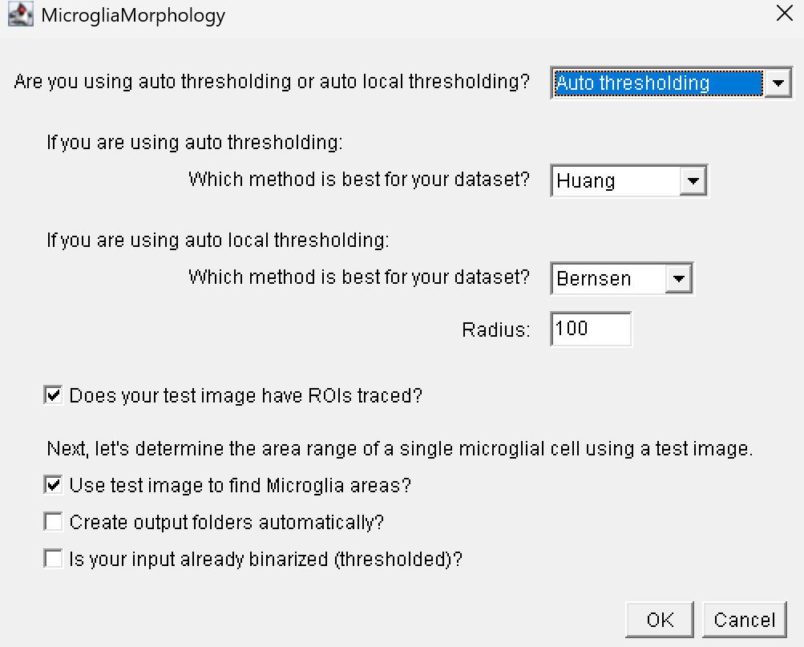

# MicrogliaMorphology2

#### *An updated version of the ImageJ macro for microglia morphology analysis*

**Created**: 21 January, 2026 **Last updated**: 21 January, 2026

## Welcome to MicrogliaMorphology!

MicrogliaMorphology is a user-friendly ImageJ macro that offers a

semi-automated approach to characterize 27 morphology features from

hundreds to thousands of individual microglia cells.

#### If you are using this tool, please cite the following publication:

- [Development of a high-throughput pipeline to characterize microglia

&nbsp; morphological states at a single-cell

&nbsp; resolution](https://www.eneuro.org/content/11/7/ENEURO.0014-24.2024)

> Kim J, Pavlidis P, Ciernia AV. Development of a High-Throughput

> Pipeline to Characterize Microglia Morphological States at a

> Single-Cell Resolution. eNeuro. 2024 Jul 30;11(7):ENEURO.0014-24.2024.

> doi: 10.1523/ENEURO.0014-24.2024. PMID: 39029952; PMCID: PMC11289588.

## Before you begin

### Install FIJI and plugins required for MicrogliaMorphology:

- [FIJI/ImageJ](https://imagej.net/software/fiji/?Downloads)

- [BioVoxxel Toolbox](https://imagej.net/plugins/biovoxxel-toolbox)

### Install MicrogliaMorphology scripts into ImageJ plugins folder

1.  When you download and install FIJI, your app and related

&nbsp;   scripts/plugins will be saved into a folder called “Fiji.app”.

&nbsp;   Create a new directory called “MicrogliaMorphology” under: Fiji.app

&nbsp;   > scripts > Plugins.

2.  Save the following files from this repo (can be found in

&nbsp;   macros-scripts folder) into the new MicrogliaMorphology directory:

- **MicrogliaMorphology_BioVoxxel.ijm**

- **MicrogliaMorphology2.ijm**

- **MicrogliaMorphology_ColorByCluster.ijm**

3.  Restart ImageJ

4.  MicrogliaMorphology should now appear under Plugins (at bottom of

&nbsp;   drop-down) in your ImageJ toolbar, under which you can find all

&nbsp;   three macros that you just installed, as well as a subdirectory

&nbsp;   containing the individual steps of the pipeline so that you can

&nbsp;   start from any point. Any of them can be clicked on to begin their

&nbsp;   respective user prompts. They should be used in the order they are

&nbsp;   listed in above.

### Some notes about MicrogliaMorphology

**Semi-automated workflow**: MicrogliaMorphology wraps around the ImageJ

plugin BioVoxxel Toolbox in Step 1, which is not compatible to call

to using the ImageJ macro language.

The only other user input involves following prompts to select input

folders to call from and output folders to write to, with the option of

batch-processing input files for each step if desired. Otherwise, all

protocols, computation, and analysis described have been automated

within MicrogliaMorphology.

**Image preparation prior to MicrogliaMorphology**: When generating your

single-channel input .tiff images which contain the microglia you want

to analyze, include any important metadata tied to that image in its

title, with each descriptor separated by an underscore. For example:

“CohortName_AnimalID_Condition_Sex_BrainRegion.tiff” Formatting this way

is very important for compatibility with

[MicrogliaMorphologyR](https://github.com/ciernialab/MicrogliaMorphologyR)

functions.

**Integration with ROIMAPer ImageJ Plugin** (or any other method of

tracing Regions of Interest prior to using MicrogliaMorphology): If you

are interested in a specific region of interest (ROI) within your

images, you can trace these in ImageJ prior to running

MicrogliaMorphology to characterize the microglia within those ROIs.

[ROIMAPer](https://github.com/ciernialab/ROIMAPer) is one ImageJ tool that

you can use to align your brain images to the [Allen Brain Institute

reference mouse brain atlas](https://mouse.brain-map.org/static/atlas).

You can also manually trace any ROIs on your images. Just make sure to

save your .tif files so that they include the ROIs (example below), and

click the check box next to any questions such as **“Do your input

images have ROIs traced?”** that pop up in the MicrogliaMorphology

prompts. This will ensure that only the part of the image that is

contained within the ROI will be analyzed.

## Video Tutorial: How to use MicrogliaMorphology

Please watch this video before proceeding to the section below, which

contains details for specific steps which are meant to help guide you to

use the tool. Most of the detail is in the video, so it is important

that you watch this prior to beginning to use MicrogliaMorphology!

## Steps in MicrogliaMorphology and how to navigate them

### 1. Determine dataset-specific parameters to use in Steps 3-4

Determine thresholding parameters using BioVoxxel Toolbox plugin (user

input required)

1.  Run MicrogliaMorphology_BioVoxxel script in ImageJ: *Plugins >

&nbsp;   MicrogliaMorphology > MicrogliaMorphology_BioxVoxxel*

2.  Use **ThresholdCheck** feature within BioVoxxel Toolbox plugin to

&nbsp;   interactively determine the best thresholding parameters for your

&nbsp;   dataset. 

&nbsp;   - Click/specify the following options in the pop-up box.

&nbsp;   

&nbsp;   - ThresholdCheck is a nifty tool that helps you decide which of the

&nbsp;     16 auto thresholding and 9 auto local thresholding parameters

&nbsp;     within ImageJ are best suited for your image set. Auto

&nbsp;     thresholding takes into account the entire image space when

&nbsp;     binarizing to distinguish background from signal, while auto local

&nbsp;     thresholding only takes into account smaller parts of the image at

&nbsp;     a time using a defined radius. You can follow these links to read

&nbsp;     more about [auto

&nbsp;     thresholding](https://imagej.net/plugins/auto-threshold) vs. [auto

&nbsp;     local

&nbsp;     thresholding](https://imagej.net/plugins/auto-local-threshold).

&nbsp;   - A radius of 100 will typically work well for auto local

&nbsp;     thresholding microglia images, but you may need to run the

&nbsp;     ThresholdCheck a few times using different radius values to

&nbsp;     optimize the parameters to best capture fully connected, single

&nbsp;     microglia in your thresholded images. When ‘Quantification

&nbsp;     (relative)’ option is selected, the plugin will give you a

&nbsp;     recommended thresholding method at the end of the results file -

&nbsp;     this is a good starting point, but you should visually verify by

&nbsp;     looking through ALL of the threshold methods to determine which is

&nbsp;     best for your dataset: capturing as many branches as possible that

&nbsp;     are connected to cell bodies, while minimizing overlap between

&nbsp;     cells. ThresholdCheck will give you a gallery of 25 different

&nbsp;     thresholding settings on the image you input - each image is color

&nbsp;     coded accordingly - from the [BioVoxxel

&nbsp;     website](https://imagej.net/plugins/biovoxxel-toolbox#threshold-check),

&nbsp;     where you can find more information in the ThresholdCheck feature:

&nbsp;   

&nbsp;   - Here are some examples of under, well, and over-thresholded

&nbsp;     microglia:

&nbsp;   

&nbsp;   - **Make sure to note the final thresholding parameters you choose

&nbsp;     for your image set as you will need to input these choices into

&nbsp;     MicrogliaMorphology**.

#### *MicrogliaMorphology ImageJ macro begins here*

MicrogliaMorphology will first prompt you to specify the thresholding

parameters that you decided on in Step 1 (which is why it is important

to write them down!):

Determine single-cell area range (user input required)

In this step, you are determining the cutoff ranges (min and max) for

what is considered a single microglia cell. Use the following guidelines

when picking representative cells on both extremes:

- **When selecting particles that are too small to be considered single

&nbsp; cells:** select particles that you would consider *almost* as big as a

&nbsp; single-cell, but not a single cell.

&nbsp; - **When selecting particles that are too big to be considered single

&nbsp;   cells:** select particles that you would consider as 2 obviously

&nbsp;   overlapping cells.

&nbsp; - Here are examples of particles that are too small or too big to be

&nbsp;   considered single cells: 

After you are done determining the lower and upper bounds for cell area,

MicrogliaMorphology will provide a summary of the final thresholding and

cell area parameters that will be applied in steps 2-4. You will see a

window like the one below pop up before moving on to step 2.

Additionally, in your home directory, you will find a file called

FinalDatasetParameters.txt which notes all of this information for your

records.

#### Steps 2-4 will use the final parameters that you specified within the macro such that the only user input required is to follow user prompts to specify folders to read from and write output to. You can consult the video of how to use MicrogliaMorphology at the start of this document for more information.

### 2. Threshold images adapted from [standard protocol](https://www.jove.com/t/57648/quantifying-microglia-morphology-from-photomicrographs)

- In this step, a file called “Areas.csv” will be generated and saved to

&nbsp; your home directory. This contains the areas of each image (either the

&nbsp; full image or the roi within the image, depending on what you

&nbsp; specified), which you can use as input downstream in

&nbsp; MicrogliaMorphologyR to obtain density measures (microglia cell #s /

&nbsp; area analyzed).

### 3. Single-cell measurement

#### *MicrogliaMorphology ImageJ macro ends here*

Some important notes

## ColorByCluster feature

ColorByCluster allows you to color the microglia cells in the original

immunofluorescent .tiff images by their cluster identifications. This

macro is meant to be complimentary to the output generated using

MicrogliaMorphologyR (see [ColorByCluster

section](https://github.com/ciernialab/MicrogliaMorphologyR#colorbycluster)

in the MicrogliaMorphologyR Github repo). The ColorByCluster feature

allows you to visually validate morphological clusters and gain insight

into their spatial distribution in the brain. This macro colors

microglia in one image of interest at a time, or batch processes a group

of images. To run this macro, you will need the following:

- Original immunofluorescent .tiff image(s) that was input into

&nbsp; MicrogliaMorphology

- Thresholded .tiff image(s) that was output by MicrogliaMorphology

- ColorByCluster labels .csv file(s) generated using

&nbsp; [MicrogliaMorphologyR](https://github.com/ciernialab/MicrogliaMorphologyR#colorbycluster)

- For batch processing: new folder to write final ColorBycluster images

&nbsp; to

If you are running individual images: After you finish running

ColorByCluster on your image and saved your final outputs, make sure to

**close all ImageJ windows** before proceeding to the next image!

