# MicrogliaMorphology2

#### *An updated version of the ImageJ macro for microglia morphology analysis*

MicrogliaMorphology is a user-friendly ImageJ macro that offers asemi-automated approach to characterize 40 morphology features fromhundreds to thousands of individual microglia cells.
This is a modified version of [MicrogliaMorphology](https://github.com/ciernialab/MicrogliaMorphology) with several changes: It is more stable when working with big datasets, that crashed the original pipeline under certain circumstances. This version can run on multiple regions per image, and quantify channel intensity within the microglia. The output measurements are slightly different, so if you want to replicate the original data, please refer to the original github. 
The former FracLac analysis had a memory leak, leading to issues when analyzing more than circa 20000 cells. Now we are not using FracLac anymore, and not creating individual image files for every cell, leading to a decreased file load. 

**Created**: 21 January, 2026 **Last updated**: 11 March, 2026

   ## Citation

If you are using this tool, please cite the following publication:

- [Development of a high-throughput pipeline to characterize microglia morphological states at a single-cell resolution](https://www.eneuro.org/content/11/7/ENEURO.0014-24.2024)

> Kim J, Pavlidis P, Ciernia AV. Development of a High-Throughput Pipeline to Characterize Microglia Morphological States at a Single-Cell Resolution. eNeuro. 2024 Jul 30;11(7):ENEURO.0014-24.2024. doi: 10.1523/ENEURO.0014-24.2024. PMID: 39029952; PMCID: PMC11289588.

   ## Installation and setup

   #### Install FIJI and plugins required for MicrogliaMorphology:
- [FIJI/ImageJ](https://imagej.net/software/fiji/?Downloads)

- [BioVoxxel Toolbox](https://imagej.net/plugins/biovoxxel-toolbox)

  #### Install MicrogliaMorphology scripts into ImageJ plugins folder

1.  When you download and install FIJI, your app and related scripts/plugins will be saved into a folder called “Fiji.app”. Create a new directory called “MicrogliaMorphology” under: Fiji.app > scripts > Plugins.

2.  Save the following files from this repo (can be found in macros-scripts folder) into the new MicrogliaMorphology directory:

- **MicrogliaMorphology_BioVoxxel.ijm**

- **MicrogliaMorphology2.ijm**

- **MicrogliaMorphology_ColorByCluster.ijm**

3.  Restart ImageJ

4.  MicrogliaMorphology should now appear under Plugins (at bottom of drop-down) in your ImageJ toolbar, under which you can find all three macros that you just installed, as well as a subdirectory containing the individual steps of the pipeline so that you can start from any point. Any of them can be clicked on to begin their respective user prompts. They should be used in the order they are listed in above.

   

      
   ## Some notes about MicrogliaMorphology

**Semi-automated workflow**: MicrogliaMorphology wraps around the ImageJ plugin BioVoxxel Toolbox in Step 1, which is not compatible to call to using the ImageJ macro language. The only other user input involves following prompts to select input folders to call from and output folders to write to, with the option of batch-processing input files for each step if desired. Otherwise, all protocols, computation, and analysis described have been automated within MicrogliaMorphology.

**Image preparation prior to MicrogliaMorphology**: When generating your single-channel input .tiff images which contain the microglia you want to analyze, include any important metadata tied to that image in its title, with each descriptor separated by an underscore. For example: “CohortName_AnimalID_Condition_Sex_BrainRegion.tiff” Formatting this way is very important for compatibility with [MicrogliaMorphologyR](https://github.com/ciernialab/MicrogliaMorphologyR) functions.

**Integration with ROIMAPer ImageJ Plugin** (or any other method of tracing Regions of Interest prior to using MicrogliaMorphology): If you are interested in a specific region of interest (ROI) within your images, you can trace these in ImageJ prior to running MicrogliaMorphology to characterize the microglia within those ROIs. [ROIMAPer](https://github.com/ciernialab/ROIMAPer) is one ImageJ tool that you can use to align your brain images to the [Allen Brain Institute reference mouse brain atlas](https://mouse.brain-map.org/static/atlas). You can also manually trace any ROIs on your images. Just make sure to name the ROIs, save your .tif files so that they include the ROIs (example below), and click the check box next to any questions such as **“Do your input images have ROIs traced?”** that pop up in the MicrogliaMorphology prompts. This will ensure that only the part of the image that is contained within the ROI will be analyzed.

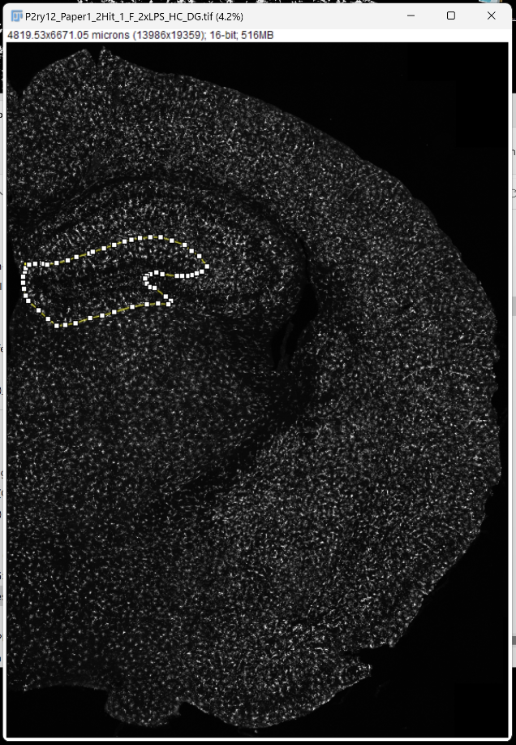

## Video Tutorial: How to use MicrogliaMorphology

Please watch this video before proceeding to the section below, which contains details for specific steps which are meant to help guide you to use the tool. Most of the detail is in the video, so it is important that you watch this prior to beginning to use MicrogliaMorphology!

## Steps in MicrogliaMorphology and how to navigate them

   
### 1. Determine dataset-specific parameters to use in Steps 4-5

#### Determine thresholding parameters using BioVoxxel Toolbox plugin (user input required)

1.  Run MicrogliaMorphology_BioVoxxel script in ImageJ: *Plugins > MicrogliaMorphology > MicrogliaMorphology_BioxVoxxel*

2.  Use **ThresholdCheck** feature within BioVoxxel Toolbox plugin to interactively determine the best thresholding parameters for your dataset.

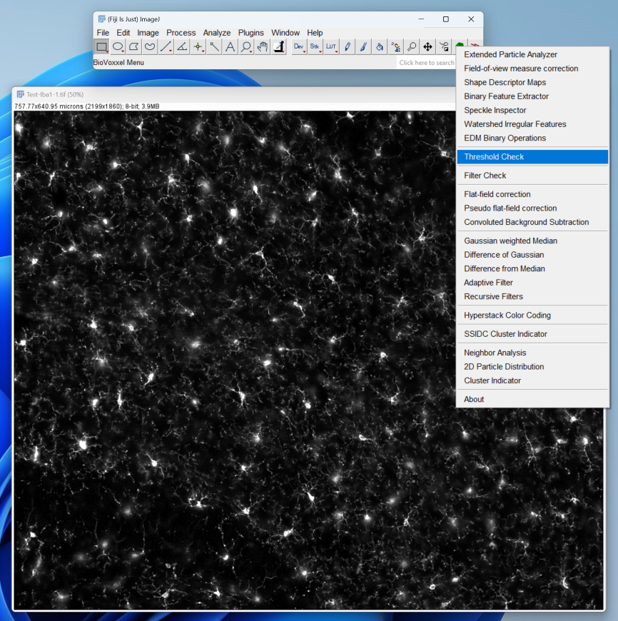

   - Click/specify the following options in the pop-up box.

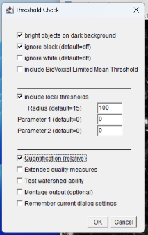

   - ThresholdCheck is a nifty tool that helps you decide which of the 16 auto thresholding and 9 auto local thresholding parameters within ImageJ are best suited for your image set. Auto thresholding takes into account the entire image space when binarizing to distinguish background from signal, while auto local thresholding only takes into account smaller parts of the image at a time using a defined radius. You can follow these links to read more about [auto thresholding](https://imagej.net/plugins/auto-threshold) vs. [auto local thresholding](https://imagej.net/plugins/auto-local-threshold).

   - A radius of 100 will typically work well for auto local thresholding microglia images, but you may need to run the ThresholdCheck a few times using different radius values to optimize the parameters to best capture fully connected, single microglia in your thresholded images. When ‘Quantification (relative)’ option is selected, the plugin will give you a recommended thresholding method at the end of the results file - this is a good starting point, but you should visually verify by looking through ALL of the threshold methods to determine which is best for your dataset: capturing as many branches as possible that are connected to cell bodies, while minimizing overlap between cells. ThresholdCheck will give you a gallery of 25 different thresholding settings on the image you input - each image is color coded accordingly - from the [BioVoxxel website](https://imagej.net/plugins/biovoxxel-toolbox#threshold-check), where you can find more information in the ThresholdCheck feature:

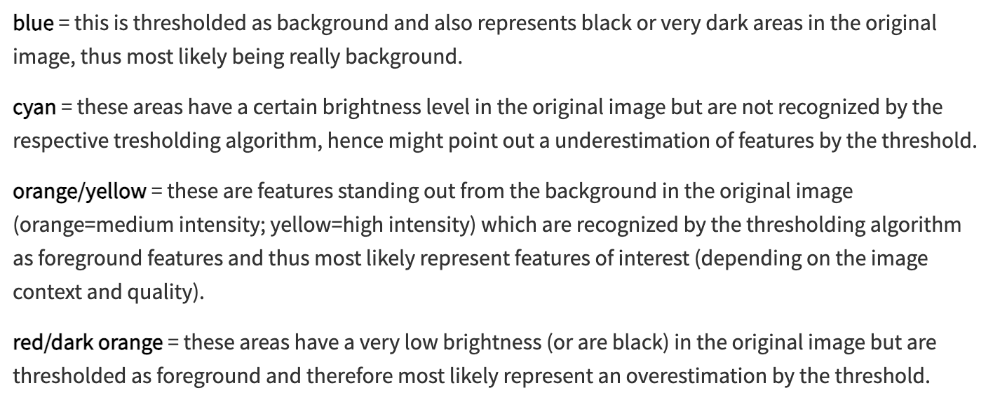
   - Here are some examples of under, well, and over-thresholded microglia:

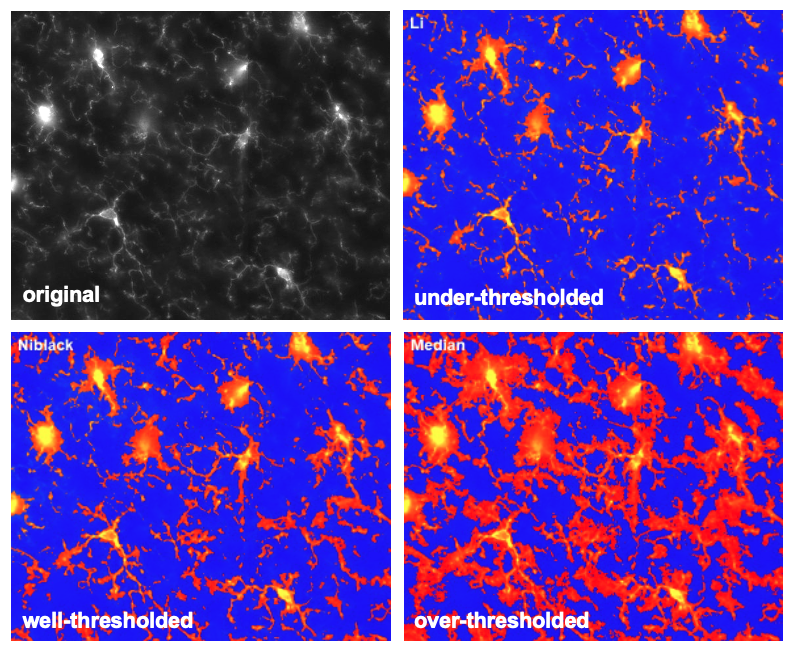

   - **Make sure to note the final thresholding parameters you choose for your image set as you will need to input these choices into MicrogliaMorphology**.

   
### 2. Start the program

If you followed the [Installation and setup](https://github.com/ciernialab/MicrogliaMorphology2/edit/main/README.md#installation-and-setup) steps correctly, the code should show up in FIJI under Plugins>Microglia Morphology>MicrogliaMorphology Program2.

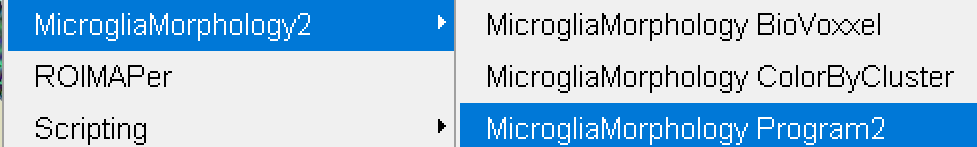

### 3. General settings

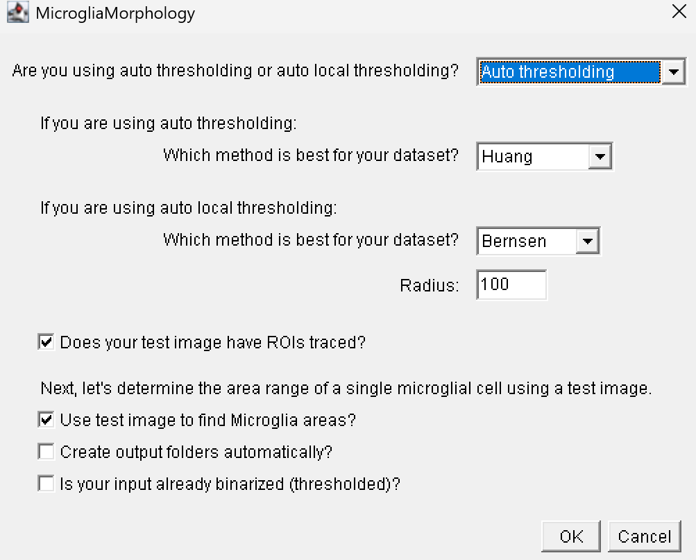
There are three types settings to specify: 

#### Thresholding

These are the parameters determined in [Step 1](https://github.com/ciernialab/MicrogliaMorphology2/edit/main/README.md#1-determine-dataset-specific-parameters-to-use-in-steps-4-5).

Which type of Thresholding will you use, global or local? Which thresholding algorithm will it be? If you are choosing local: which radius counts as local?

#### Cell size cutoff

Determine single-cell area range (user input required). Either uses an example image, or skip the use of a test image and enter the area range manually.

In this step, you are determining the cutoff ranges (min and max) for what is considered a single microglia cell. Use the following guidelines when picking representative cells on both extremes:

- **When selecting particles that are too small to be considered single cells:** select particles that you would consider *almost* as big as a single-cell, but not a single cell.
- **When selecting particles that are too big to be considered single cells:** select particles that you would consider as 2 obviously overlapping cells.

- Here are examples of particles that are too small or too big to be considered single cells: 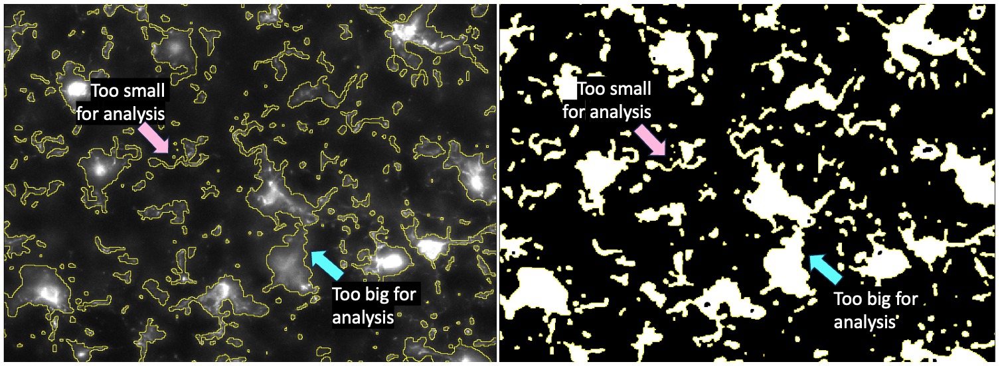

Alternatively, if you already know your cutoff ranges, you can skip this step and enter them manually by unselecting "Use test image to find Microglia areas". 

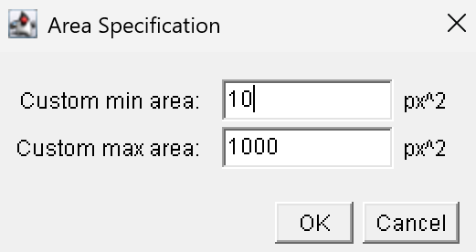

After you are done determining the lower and upper bounds for cell area, MicrogliaMorphology will provide a summary of the final thresholding and cell area parameters that will be applied in steps 2-4. You will see a window like the one below pop up before moving on to step 2. Additionally, in your home directory, you will find a file called FinalDatasetParameters.txt which notes all of this information for your records.

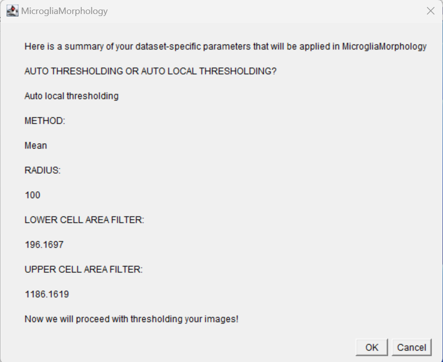

#### Input and output settings

If you are using original images, leave the "Is your input already binarized" tag unchecked. 
In case you already have performed thresholding with this dataset, you can input those images instead.

The output folders "ThresholdedImages" and "MeasurementOutputs" can be automatically created. 
Otherwise, you will be asked to choose two output folders to save the thresholded outputs and the single-cell measurements too. 
These folders should be empty.

Next, specify the settings for you input files:
- Which range of files do you want to analyze? Files are sorted in descending order, so "Test_image_1.tif", "Test_image_9.tif", and "Test_image_10.tif" would be sorted as "Test_image_1.tif", "Test_image_10.tif", and "Test_image_9.tif"
- When working with multi-channel images, which channel contains the microglia-specific signal? If there is only one channel, leave it at "1". The channel order has to be consistent between all input images.
- Do you want to quantify the intensity of another channel within the microglia? This can be used to differentiate microglia morphology between stain positive an stain negative cells.
   - Which channel - can also be the microglia-specific channel.
   - If you chose to skip the thresholding step by inputing binarized images, you will be asked to provide the original images again, to obtain the quantification channel.
 
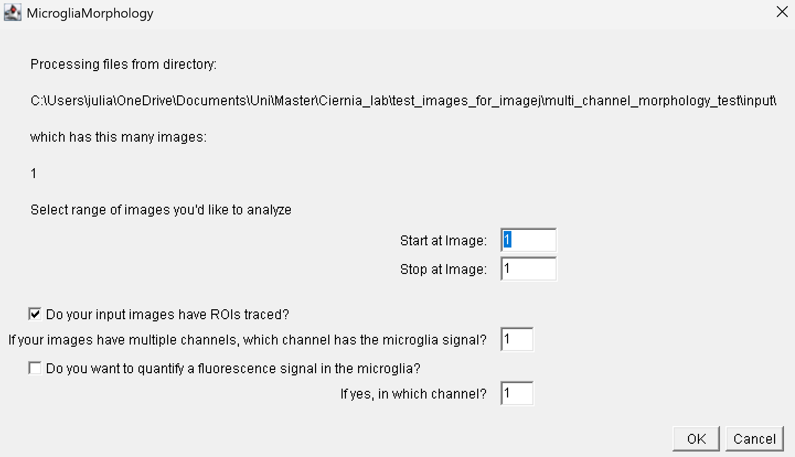

### 4. Threshold images

Is performed automatically by the plugin.
Adapted from [standard protocol](https://www.jove.com/t/57648/quantifying-microglia-morphology-from-photomicrographs)
- In this step, a file called “Areas.csv” will be generated and saved to  your home directory. This contains the areas of each image (either the full image or the roi within the image, depending on what you specified), which you can use as input downstream in  MicrogliaMorphologyR to obtain density measures (microglia cell #s /  area analyzed).

   
### 5. Single-cell measurement

Now one .csv file per input image will be produced in your output folder, specifying the measurements per cell in every row, in addition to a Region column, that specifies which region this cell has come from.
The output measures are: 
|Output | Description |
| ----- | ----------- |
| Label | The name of the individual ROI, sometimes fused to the image and region name |
| Image | The image name |
| Region | The region name. If no region was present or "Do your input images have ROIs" was unselected will say "full_brain" |
| Area | Area of the cell |
| Optional: Mean, Min, Max, IntDen | The mean, minimum, and maximum and integrateddensity of the  grey intensity in the quantification channel, when quantification was checked |
| Perim. | Perimeter of the cell |
| Major | Major radius of the fit ellipse |
| Minor | Minor radius of the fit ellipse |
| Circ. | Circularity, the relationship between area and perimeter of the cell |
| Feret | The major Feret's calliper of the cell |
| MinFeret | The minor Feret's calliper of the cell |
| Round | The roundness of the cell |
| Solidity | The solidity of the cell |
| hull_X | The same measure but applied to the convex hull of the cell |
| Hull span ratio | The ratio between the major and the minor Feret's calliper of the convex hull |
| Max/min radii from hull | The ratio between the maximum radius of the convex hull to the smallest radius of the convex hull. Radius is taken to the center of mass of the convex hull |
| Relative variation (CV) hull | The coefficient of variation (CV) of all long radii (distance from center of mass to corners of convex hull) and all short radii (distance from center of mass to closest point on edge of convex hull) |
| skeleton_X | Results from the Analyze Skeleton function | 

   
### 6. Run MicrogliaMorphologyR

Available at [github.com/ciernialab/MicrogliaMorphologyR](https://github.com/ciernialab/MicrogliaMorphologyR).
This script will the Microglia cluster into distinct states based on their morphology. 
An output from the MicrogliaMorphologyR script will provide color information to color in the original microglia based on their cluster.

### 7. ColorByCluster feature

ColorByCluster allows you to color the microglia cells in the original immunofluorescent .tiff images by their cluster identifications. This macro is meant to be complimentary to the output generated using MicrogliaMorphologyR (see [ColorByCluster section](https://github.com/ciernialab/MicrogliaMorphologyR#colorbycluster) in the MicrogliaMorphologyR Github repo). The ColorByCluster feature allows you to visually validate morphological clusters and gain insight into their spatial distribution in the brain. This macro colors microglia in one image of interest at a time, or batch processes a group of images. To run this macro, you will need the following:

- Original immunofluorescent .tiff image(s) that was input into MicrogliaMorphology

- Thresholded .tiff image(s) that was output by MicrogliaMorphology

- ColorByCluster labels .csv file(s) generated using [MicrogliaMorphologyR](https://github.com/ciernialab/MicrogliaMorphologyR#colorbycluster).
   - To work successfully, the file should look like this (a column with an empty first row and ascending numbers after that; a column named "Cluster"; a column named "ID" with content matching the single-cell ROI labels; and a column named "Region" with names matching the analyzed regions or "full_brain" if no regions were provided:

|   | Cluster	| ID	| Region |
| - | -------- | --- | ------ |
| 1 | 2 | 0001-0034 | Region1 |
| 2 | 1 | 0001-0026 | Region2 |
| 3 | 1 | 0002-0193 | Region2 |
| 4 | 3 | 0003-0351 | Region2 |
| 5 | 1 | 0001-0039 | Region3 |
| 6 | 3 | 0002-0062 | Region3 |
| 7 | 2 | 0003-0175 | full_brain |
| 8 | 2 | 0004-0290 | full_brain |

- For batch processing: new folder to write final ColorBycluster images to

If you are running individual images: After you finish running ColorByCluster on your image and saved your final outputs, make sure to **close all ImageJ windows** before proceeding to the next image!

